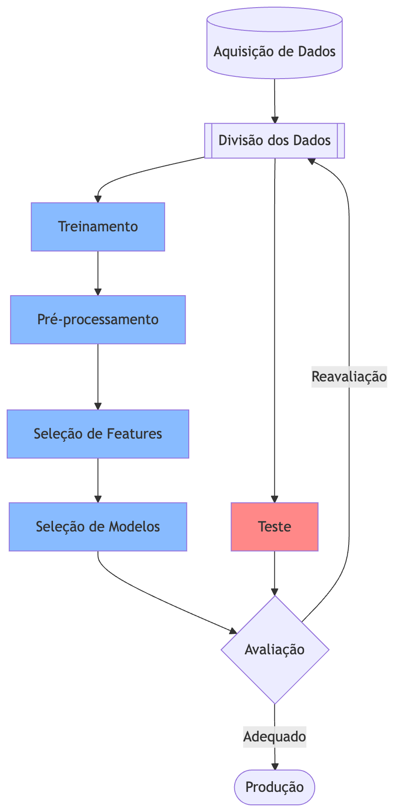
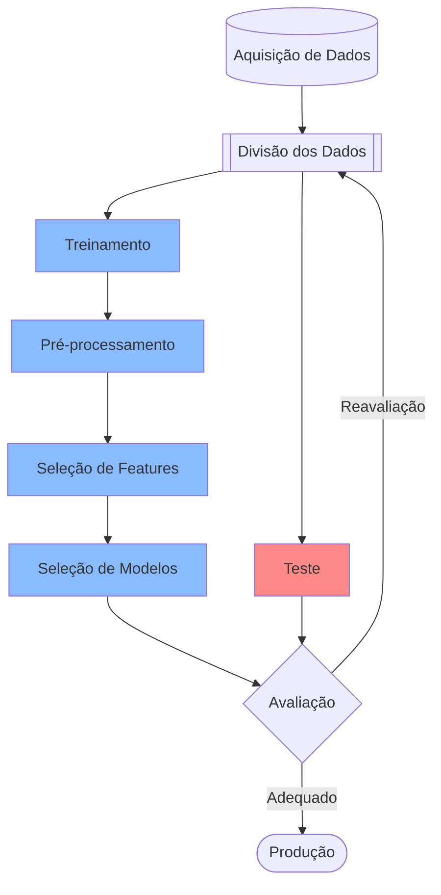

# Divisão de Dados, Data Leakage e Validação Cruzada

Como vimos anteriormente, é importante separar os dados de treino e teste para avaliar o desempenho do modelo em dados não vistos durante o treinamento. No entanto, a simples divisão dos dados em um conjunto de treino e um conjunto de teste pode levar a **resultados instáveis**, especialmente se o conjunto de dados for pequeno.

Em machine learning (ML), o processo de construção de modelos preditivos envolve a divisão e manipulação de dados para garantir que o modelo generalize bem para dados não vistos. Três conceitos fundamentais nesse contexto são:

- os conjuntos de treino e teste;
- o data leakage; e
- a validação cruzada.

Esses elementos são essenciais para avaliar a performance de modelos de forma robusta, evitando *overfitting* e *underfitting*.

## Conjuntos de Treino e Teste

Os conjuntos de treino e teste representam a divisão fundamental dos dados em machine learning supervisionado. O conjunto de treino (training set) é utilizado para ajustar os parâmetros do modelo, permitindo que ele aprenda padrões nos dados. Já o conjunto de teste (test set) é reservado para avaliar a performance do modelo em dados não vistos durante o treinamento, simulando o desempenho em cenários reais.

### Importância

A divisão em treino e teste é motivada pela necessidade de estimar a capacidade de generalização do modelo. Se todo o dataset for usado para treinamento, não há como medir o erro de generalização, levando a uma avaliação otimista e irreal. Tipicamente, adota-se uma proporção de $70-80\%$ para treino e $20-30\%$ para teste, dependendo do tamanho do dataset. Essa divisão deve ser aleatória e estratificada (preservando a distribuição das classes em problemas de classificação) para evitar viés.

### Exemplo

Considere um dataset de previsão de preços de casas (regressão), como o [Boston Housing Dataset](https://www.kaggle.com/code/prasadperera/the-boston-housing-dataset). Suponha que temos 500 amostras. Dividimos 70% (350 amostras) para treino, onde o modelo (ex.: regressão linear) aprende relações entre features como área da casa e número de quartos com o preço. Os 30% restantes (150 amostras) são usados para teste, calculando métricas como *Mean Squared Error* (**MSE**). Se o **MSE** no treino for baixo mas alto no teste, indica *overfitting*.

### Iris Dataset

```python
from sklearn.datasets import load_iris
from sklearn.model_selection import train_test_split
from sklearn.ensemble import RandomForestClassifier
from sklearn.metrics import accuracy_score

# Carregar o dataset
iris = load_iris()
X = iris.data  # Features
y = iris.target  # Labels

# Dividir em treino (80%) e teste (20%), com estratificação
X_train, X_test, y_train, y_test = train_test_split(X, y, test_size=0.2, random_state=42, stratify=y)

# Treinar um modelo simples
model = RandomForestClassifier(random_state=42)
model.fit(X_train, y_train)

# Avaliar no teste
predictions = model.predict(X_test)
accuracy = accuracy_score(y_test, predictions)
print(f"Acurácia no conjunto de teste: {accuracy:.2f}")
```

### Ciclo






## Data Leakage

O data leakage ocorre quando informações do conjunto de teste são acidentalmente usadas durante o treinamento do modelo, levando a uma avaliação otimista e irreal. Isso pode acontecer de várias formas, como:

- **Pré-processamento inadequado**: Aplicar técnicas de pré-processamento (ex.: normalização, imputação) antes de dividir os dados em treino e teste pode causar vazamento, pois as estatísticas calculadas (média, desvio padrão) incluem informações do teste. O correto é realizar a divisão primeiro e, em seguida, aplicar o pré-processamento apenas ao conjunto de treino, usando as mesmas estatísticas para transformar o teste. O uso de pipelines do scikit-learn pode ajudar a evitar esse tipo de vazamento. E.g.: aplicar `StandardScaler().fit_transform()` em todo o dataset antes de dividir $\implies$ estatísticas do teste vazam para o treino.

- **Seleção de features**: Realizar seleção de features usando o conjunto completo antes da divisão pode levar a vazamento, pois as features selecionadas podem ser influenciadas por informações do teste. O correto é realizar a seleção de features apenas no conjunto de treino e, posteriormente, aplicar a mesma seleção ao teste. E.g.: usar `SelectKBest().fit()` em todo o dataset antes de dividir $\implies$ as features selecionadas são influenciadas por informações do teste.

- **Uso de variáveis temporais**: Em séries temporais, usar dados futuros para prever o passado pode causar vazamento, pois o modelo tem acesso a informações que não estariam disponíveis no momento da previsão. E.g.: prever vendas diárias usando a feature “vendas do dia anterior”. Se você não respeitar a ordem temporal e o `train_test_split` embaralhar os dados, o modelo “vê o futuro”.

- **Vazamento de rótulos**: Incluir o rótulo (target) como uma feature durante o treinamento pode levar a vazamento, pois o modelo aprende a prever o rótulo usando ele mesmo. E.g.: em um problema de classificação, incluir a coluna do rótulo como uma feature no conjunto de treino $\implies$ o modelo aprende a “adivinhar” o rótulo.

### Consequências

O data leakage pode levar a uma avaliação irreal do modelo, onde o desempenho no teste é significativamente melhor do que o desempenho real em dados não vistos. Isso pode resultar em modelos que parecem promissores durante a fase de desenvolvimento, mas falham ao serem implementados em produção.

### Prevenção

Para evitar o data leakage, é crucial seguir boas práticas, como:

- Realizar a divisão dos dados em treino e teste antes de qualquer pré-processamento ou seleção de features.
- Garantir que as transformações de dados sejam aplicadas apenas ao conjunto de treino e, posteriormente, aplicadas ao teste usando as mesmas estatísticas calculadas no treino. Vide o uso de pipelines do scikit-learn para facilitar esse processo.
- Em séries temporais, garantir que a divisão respeite a ordem temporal dos dados, evitando o uso de informações futuras para prever o passado.

## Validação Cruzada (*Cross-Validation*)

A validação cruzada, *cross-validation*, é uma técnica que permite avaliar a performance de um modelo de forma mais robusta, especialmente em conjuntos de dados pequenos.

Na validação cruzada, o dataset é dividido em múltiplos subconjuntos (folds), e o modelo é treinado e avaliado várias vezes, cada vez usando um fold diferente como teste e os outros como treino. Isso ajuda a obter uma estimativa mais confiável da performance do modelo, reduzindo a variância associada à divisão aleatória dos dados.

Métodos comuns de validação cruzada incluem:

| Método | Quando usar | Vantagens | Desvantagens | Tipo de problema recomendado |
|--------|------------|-----------|--------------|-----------------------------|
| K-Fold | Dados em geral (padrão) | Simples, eficiente | Não preserva distribuição de classes | Regressão e classificação balanceada |
| Stratified K-Fold | Classificação (especialmente desbalanceada) | Mantém proporção de classes em todos os folds | Ligeiramente mais lento | Classificação |
| Leave-One-Out (LOO) | Datasets muito pequenos (< 100–200 amostras) | Usa quase todos os dados para treino | Muito lento (n folds) e alta variância | Regressão e classificação pequenos |
| TimeSeriesSplit | Dados temporais / séries temporais | Respeita ordem cronológica (sem vazamento) | Menos flexível | Previsão de séries temporais |
| Group K-Fold | Dados com grupos (pacientes, usuários, etc.) | Evita vazamento entre grupos relacionados | Requer coluna de grupos | Dados agrupados (saúde, finanças) |

O método mais comum é o **k-fold cross-validation**, onde o dataset é dividido em *k* partes (folds). O modelo é treinado *k* vezes, cada vez usando um fold diferente como teste e os outros *k-1* folds como treino. A performance final é a média das métricas obtidas em cada fold.

### Importância

A validação cruzada é importante porque fornece uma estimativa mais robusta da performance do modelo, especialmente em conjuntos de dados pequenos. Ela ajuda a reduzir a variância associada à divisão aleatória dos dados, permitindo que o modelo seja avaliado em diferentes subconjuntos do dataset. Isso é crucial para evitar *overfitting* e *underfitting*, garantindo que o modelo generalize bem para dados não vistos.

### Vantagens

- Fornece uma estimativa mais confiável da performance do modelo;
- Reduz a variância associada à divisão aleatória dos dados;
- Permite avaliar o modelo em diferentes subconjuntos do dataset;
- Útil para conjuntos de dados pequenos, onde a divisão simples pode levar a resultados instáveis.


### Iris Dataset

```python
from sklearn.datasets import load_iris
from sklearn.model_selection import KFold, cross_val_score
from sklearn.ensemble import RandomForestClassifier

# Carregar o dataset
iris = load_iris()
X, y = iris.data, iris.target

# Definir o modelo
model = RandomForestClassifier(n_estimators=100, random_state=42)

# Configurar o K-Fold Cross-Validation
kf = KFold(n_splits=5, shuffle=True, random_state=42)

# Avaliar o modelo usando cross-validation
scores = cross_val_score(model, X, y, cv=kf, scoring='accuracy')

print(f"Acurácias por fold: {scores}")
print(f"Acurácia média: {scores.mean():.2f}")
print(f"Desvio padrão: {scores.std():.2f}")
```


### **Para cada fold**

O pré-processamento (scaling, encoding, imputação etc.) e a seleção de features (feature selection) devem ser refeitos do zero **em cada fold** da validação cruzada. Isso é obrigatório para evitar data leakage (vazamento de informação do fold de validação para o treino).


#### Por que isso é importante?

Se você aplicar `StandardScaler`, `PCA`, `SelectKBest`, `RFE`, `MutualInformation` etc. no dataset inteiro antes de rodar o `cross_val_score` ou `GridSearchCV`, as estatísticas (média, desvio padrão, features selecionadas) do fold de validação vão “vazar” para o treino.

Isso gera uma estimativa otimisticamente enviesada da performance (o modelo parece melhor do que realmente é).
A documentação oficial do scikit-learn e a comunidade de ML são unânimes: todo pré-processamento supervisionado ou que depende dos dados deve acontecer dentro do loop de CV.

#### A forma correta: *Pipeline*

O Pipeline do scikit-learn garante automaticamente que:

Em cada fold da CV:

- O pipeline recebe apenas os dados de treino daquele fold.
- Todos os steps (`StandardScaler`, `SelectKBest`, `PCA`, `OneHotEncoder`, etc.) são fitados apenas nos dados de treino.
- Depois, o mesmo pipeline (já fitado) faz transform no fold de validação.
- O modelo é treinado e avaliado.

Isso é feito automaticamente pelo `cross_val_score`, `GridSearchCV`, `RandomizedSearchCV` etc.

```python
from sklearn.datasets import load_breast_cancer
from sklearn.model_selection import cross_val_score, StratifiedKFold
from sklearn.pipeline import Pipeline
from sklearn.preprocessing import StandardScaler
from sklearn.feature_selection import SelectKBest, f_classif
from sklearn.ensemble import RandomForestClassifier

data = load_breast_cancer()
X, y = data.data, data.target

# Pipeline correto (tudo dentro da CV)
pipeline = Pipeline([
    ('scaler', StandardScaler()),                    # pré-processamento
    ('feature_selection', SelectKBest(score_func=f_classif, k=15)),  # seleção de features
    ('classifier', RandomForestClassifier(random_state=42))
])

cv = StratifiedKFold(n_splits=5, shuffle=True, random_state=42)

scores = cross_val_score(pipeline, X, y, cv=cv, scoring='roc_auc')

print(f"ROC AUC médio: {scores.mean():.4f} ± {scores.std():.4f}")
```

O que acontece internamente nos 5 folds?

- **Fold 1**: fit scaler + fit SelectKBest + fit RandomForest $\implies$ apenas nas 4/5 partes de treino;
- **Fold 2**: novo scaler + nova seleção de features + novo RandomForest $\implies$ nas outras 4/5 partes
- E assim por diante.

Cada fold tem seu próprio scaler, sua própria seleção de features e seu próprio modelo.

Ao final, a média das métricas (ex.: acurácia, ROC AUC) é uma estimativa mais confiável da performance do modelo em dados não vistos, sem o risco de data leakage.